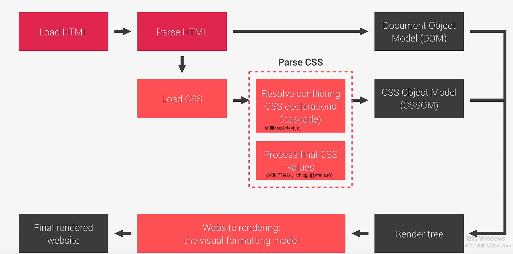
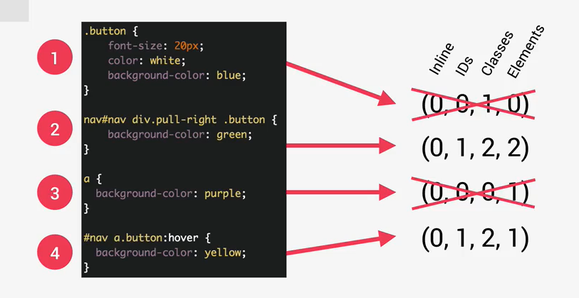
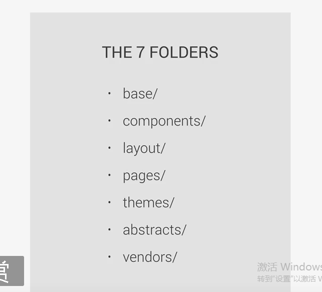

## CSS 学习

### CSS 代码实际发生了什么？

#### 1. 网页在浏览器中打开

### 2. css 选择器优先级

级联值计算，确定优先级

内联样式 > id > class , 伪类，属性 > 元素 ，伪元素

### 3. 相对值的计算

em: 相对于父元素字体大小

rem：相对于根元素字体大小

vh, vw: 相对于视口窗

百分比：相对于父元素

### 4. css视觉化模型

  

### 5. css 基本架构

